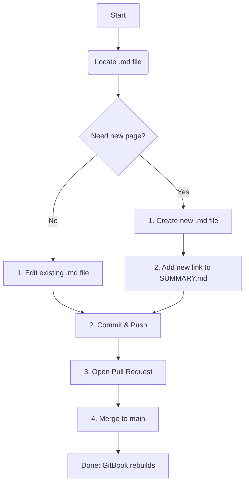

Skill: Updating and Extending GitBook Repositories
==================================================

This document outlines the essential knowledge and procedures required to effectively update, extend, and maintain a documentation repository powered by GitBook.

1\. Core Concepts & File Structure
----------------------------------

A GitBook repository is a standard Git repository containing Markdown files. The magic of GitBook lies in its specific file structure, primarily driven by `SUMMARY.md`.

-   **/ (Root Directory)**: Contains configuration files and the main `SUMMARY.md`.

-   **`README.md`**: This file serves as the landing page or introduction to your GitBook.

-   **`SUMMARY.md`**: **This is the most important file.** It defines the Table of Contents (ToC) and the hierarchical structure of your entire GitBook.

-   **Content Files (`.md`)**: These are your documentation pages, written in Markdown. They can be organized into subdirectories for clarity (e.g., `/features/feature-a.md`).

2\. The Table of Contents: `SUMMARY.md`
---------------------------------------

The `SUMMARY.md` file *is* your Table of Contents. GitBook reads this file to build the navigation sidebar.

**Structure Rules:**

-   It's a Markdown list (using `*` or `-`).

-   List items are links to your content files.

-   The link text becomes the chapter/page title in the navigation.

-   Nested lists create nested sections (chapters with sub-pages).

**Example `SUMMARY.md`:**

```
# Summary

* [Introduction](README.md)

* [Getting Started](getting-started/README.md)
    * [Installation](getting-started/installation.md)
    * [Configuration](getting-started/configuration.md)

* [Core Features](features/README.md)
    * [Feature A](features/feature-a.md)
    * [Feature B](features/feature-b.md)

* [Advanced Guide](advanced/README.md)

```

**Key Points:**

-   **`README.md` in Subfolders**: Using a `README.md` inside a subfolder (like `getting-started/README.md`) makes the parent link ("Getting Started") clickable, displaying that file's content.

-   **Unlinked Pages**: If you create a `.md` file but do *not* add it to `SUMMARY.md`, it will not appear in the navigation. It might still be accessible via search or a direct link.

3\. Workflow for Updating & Extending Content
---------------------------------------------

### A. Editing an Existing Page

1.  **Locate the File**: Find the corresponding `.md` file in the repository for the page you want to edit.

2.  **Edit Content**: Make your changes using Markdown.

3.  **Commit & Push**: Commit your changes to your branch and push to GitHub.

4.  **Pull Request**: Open a Pull Request to merge your changes into the main branch.

5.  **Publish**: Once merged, GitBook will automatically detect the changes and (if configured) rebuild and publish the updated site.

### B. Adding a New Page or Section

1.  **Create File(s)**: Create your new `.md` file(s) in the repository. Place it in a logical subdirectory (or create a new one).

2.  **Add Content**: Write the content for your new page.

3.  **Update `SUMMARY.md`**: This is the crucial step. Open the `SUMMARY.md` file and add a new list item linking to your new file.

    -   `* [My New Page Title](path/to/my-new-page.md)`

4.  **Commit & Push**: Commit *both* your new content file(s) and the updated `SUMMARY.md`.

5.  **Pull Request & Merge**: Follow the standard PR process. Once merged, GitBook will rebuild the site with your new page visible in the navigation.

4\. Markdown Rules & Formatting
-------------------------------

### A. GitHub-Flavored Markdown (GFM)

GitBook has excellent support for standard Markdown and most of GitHub-Flavored Markdown (GFM). This includes:

-   **Headings**: `# H1`, `## H2`, `### H3`

-   **Text**: `**bold**`, `*italic*`, `inline code`

-   **Lists**: Ordered (`1.`) and unordered (`*`, `-`)

-   **Links**: `[text](url)`

-   **Images**: ``

-   **Tables**: Using pipes (`|`) and hyphens (`-`)

-   **Task Lists**: `- [x] Completed item`, `- [ ] Incomplete item`

-   **Code Blocks**: Using triple backticks (```) with optional language highlighting (e.g., ```javascript).

### B. GitBook-Specific Markdown (Callouts)

GitBook adds special syntax for "callouts" or "hints" to draw attention to information.

**Syntax:**

```

This is an information block.



This is a success block.



This is a warning block.



This is a danger/error block.


```

Use these sparingly to highlight key information, warnings, or tips for the reader.

5\. Creating Diagrams (Mermaid)
-------------------------------

Beyond callouts, GitBook has excellent support for text-based diagrams using **Mermaid**. This allows you to create flowcharts, sequence diagrams, and more directly within your Markdown files without needing to upload image files.

This is the easiest and most effective way for an LLM (like Claude) to generate and publish diagrams for your documentation.

**Syntax:**

You create a Mermaid diagram by fencing your text-based syntax within a code block marked with the `mermaid` language identifier.

```


```

**Rendered Output:**

When published, GitBook will automatically render this code block into a visual flowchart.


## Assets

Images and other file assets go beneath `/.gitbook/assets` 


## When to Use This Skill

Trigger this skill when users are:

- Updating Gitbook documentation for the project 
- Querying Gitbook documentation for the project 


